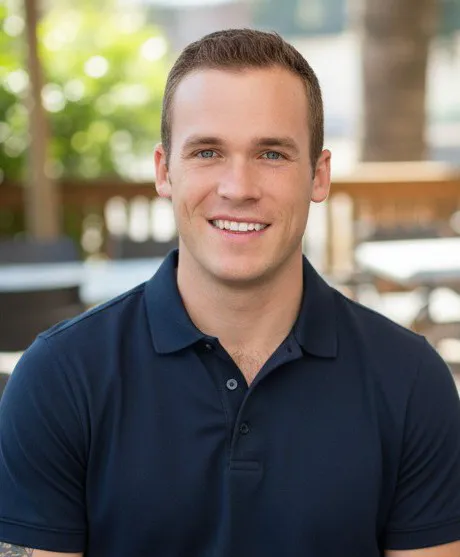

  
  <h1>Dillon Bowen</h1>
  
<strong>Marketing Strategist, Producer, Founder</strong>

  
<em>Sharp thinking. Human execution.</em>

---

### About

I build things that work in the real world.

My path hasn’t been linear. I’ve worked in film production, construction, and hospitality — high-pressure environments where showing up and solving problems actually mattered. That experience shapes how I approach marketing and AI systems today: practical, detail-oriented, and grounded in real execution.

---

### On Set

**Film & Production**

- Grip (local hire) on Disney’s *The Lone Ranger* (2013) — Moab unit under key grip J. Michael Popovich. Set dolly track for the Depp/Hammer horse scene and worked the Colorado River sandbag run.
- Co-Producer of the indie feature *Sorrow* (2015, dir. Millie Loredo, IMDb tt2140423). Scouted locations, ran logistics, and self-funded production through an in-house merchandise campaign.
- Production Coordinator for independent reality television series.
- Featured performer in the horror feature *Ravenous: You're the Main Course*.

---

### Before the Strategy Deck

**Construction & Trades**

Form setter and laborer at Straight Line Contracting in Moab, UT. Set concrete forms for million-dollar custom homes, municipal projects, cliff-edge bedrock foundations, retaining walls, and commercial work. 

Volunteered solo to set outside forms on a second-story Best Western patio during a storm on deadline — the job no one else would take.

---

### Behind the Bar

**Hospitality (2002– 2022)**

Bartender, trainer, and manager across multiple venues in Moab, UT and Minneapolis, MN.

- Bartender & Trainer at Moab Brewery & Distillery (high-volume venue)
- Manager/Server at Wild Boar Bar & Grill (Hopkins, MN)
- Earlier roles at Ray Jay’s and various spots in Moab and Minneapolis

Same standard every time: take care of the details and take care of people.

---

### The Work, Now

Founder of **Dilly’s Trading Co.** — an AI-enhanced marketing strategy consultancy helping hospitality, e-commerce, and mission-driven businesses build systems that sound human and actually work.

I combine hands-on experience with modern AI tools to create practical marketing infrastructure for small business owners who value clarity over hype.

---

### Press & Community

- Coverage in the *Moab Times-Independent* for both film work and community projects
- On-air feature on San Antonio Fox affiliate *Daytime @ Nine*
- Co-organized the Moab Toga Party cancer fundraiser (raised over $2,000 in one night for two local mothers)

---

### Let's Connect

- **Website**: [dillonbowen.netlify.app](https://dillonbowen.netlify.app/)
- **Business**: [dillystradingco.com](https://dillystradingco.com)
- **Email**: [hello@dillystrading.co](mailto:hello@dillystrading.co)

Open to real conversations about marketing systems, AI, and building things that last.

---

  
  
<em>Minneapolis, MN</em>

